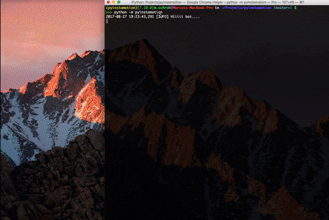

# PYINSTAMATION

> Easy to use, config oriented, instagram bot, written in python 3

[](https://travis-ci.org/dscovr/pyinstamation)
[](https://codecov.io/gh/dscovr/pyinstamation)




## **Table of Contents**

- [PYINSTAMATION](#pyinstamation)
  - [Features](#features)
  - [Quickstart](#quickstart)
  - [API Example](#api-example)
  - [Supported OS](#supported-os)
  - [Requirements](#requirements)
  - [Installation](#installation)
  - [Commands](#usage)
  - [Configuration](#configuration)
    - [Posts](#posts)
    - [Followers](#followers)
    - [Pics](#pics)
      - [Pics > files](#pics-files)
  - [Daemonization](#daemonization)
  - [Troubleshooting](#troubleshooting)


## Features

- [x] Upload pictures
- [x] Farm followers with the follow/unfollow technique
- [x] Like and comment by tags
- [x] Metrics persisted in db
- [x] Logging
- [x] Comment generator
- [ ] Dockerization
- [ ] Auto update user's description


## Quickstart

Check [pyvirtualdisplay is installed properly](http://pyvirtualdisplay.readthedocs.io/en/latest/#general)

```
make init
# set username and password in `config.yaml` and configure at will
make run-bot
```


## API Example

If you want to check how to use the bot in depth check the [examples](./examples) or read the
source. Do not run the examples from the folder, copy them to the root folder.

Example
```python
from pyinstamation.bot import InstaBot
from pyinstamation.scrapper import InstaScrapper


POST_LINK = 'p/not_a_real_post_id'
USERNAME = 'replace_this_with_your_username'
PASSWORD = 'replace_this_with_your_password'

s = InstaScrapper()
bot = InstaBot(s, username=USERNAME, password=PASSWORD)

bot.start_browser()
bot.login()
bot.like(POST_LINK)
bot.comment(POST_LINK, 'this is a simple comment')
bot.stop()

```


## Prerequisites

#### OS

```
Linux (Tested in debian)
OS X
```

#### Python versions

```
python >3.5
python >2.7  (not supported officially)
```

Remember to create a [virtualenv](https://virtualenv.pypa.io/en/stable/installation/)


## Commands

| Command | Description |
| --- | --- |
| `make init` | downloads webdriver and creates a new conf based on the default one |
| `make run-bot` | starts running the bot (remember to at least set the username and password) |
| `make install-deps` | install python dependencies |
| `make start-conf` | creates a new configuration file with the template from `default.config.yaml` |
| `make webdriver` | downloads selenium's webdriver |


## Configuration

Create a `config.yaml` and tune it at will, or use `make init`.
The options are divided in different sections.

| Option | Type | Description |
| --- | --- | --- |
| `username` * | str | instagram username to operate with |
| `password` ** | str | username's password |
| `hide_browser` | bool | does not display the browser |

\*  Required

** Required unless the bot is launched with `-p [PASSWORD]`


### Posts

| Option | Type | Description | Default |
| --- | --- | --- | --- |
| `search_tags` | str | comma separated tags to search for | [] |
| `ignore_tags` | str | comma separated tags to ignore if a post contains them while searching | [] |
| `posts_per_day` | int | number of posts to be processed in total, ignored does not count |
| `posts_per_hashtag` | int | number of posts to be processed per hashtag (not recommended) |
| `likes_per_day` | int | maximum likes given in a day | 100 |
| `like_probability` | float | probability to give a like | 0.5 |
| `comments_per_day` | int | maximum comments given in a day | 10 |
| `comment_probability` | float| probability to comment | 0.5 |
| `comment_enabled` | bool| bot will comment in the searched posts | True |
| `comment_generator` | bool | bot will generate a random generic comment | True |
| `custom_comments` | array | in case you don't want random comments, you can provide them | [] |

### Followers

| Option | Type | Description | Default |
| --- | --- | --- | --- |
| `follow_enable` | bool | while searching the bot will also follow people | True |
| `min_followers` | None or int | minimum number followers that a user must have to follow. Lower bound | 100 |
| `max_followers` | None or int | will follow users with less than this amount of followers. Upper bound | 7000 |
| `follow_probability` | float | chance to follow someone while searching, between 0 and 1 | 0.5 |
| `ignore_users` | array | users not to follow | [] |
| `follow_per_day` | int | max number of users to follow | 50 |
| `unfollow_followed_users` | bool | after a few days the bot will stop following the users followed | True |

### Pics

| Option | Type | Description | Default |
| --- | --- | --- | --- |
| `upload` | bool | when enabled attempts to upload a picture if there is one to upload | False |
| `files` | collection | the contents of the files to upload are below | [] |

#### Pics > files

| Option | Type | Description | Default |
| --- | --- | --- | --- |
| `path` * | str | absolute path to the file location. |
| `datetime` | str | format ISO 8061: `%Y-%m-%dT%H:%M:%S` eg: `2017-08-18T18:00:00`. For now, time is ignored, but the idea is to take it into account | None |
| `comment` | str | comment to be added when the pic is posted  | None |

\*  Required

For config template check [default.config.yaml](./default.config.yaml)


We told you it was easy.

## Daemonization

Use [Celery](http://docs.celeryproject.org/en/latest/userguide/daemonizing.html) or [supervisord](supervisord.org)
for this


## Troubleshooting

* If you have an error similar to `FileNotFoundError: [Errno 2] No such file or directory: 'Xephyr'`
try installing the missing dependency `sudo apt-get install xvfb xserver-xephyr`.
For more information check [pyvirtualdisplay docs](http://pyvirtualdisplay.readthedocs.io/en/latest/#general)
* If you have an error similar to `OSError: [Errno 8] Exec format error` try downloading manually
the chromedriver from [here](https://chromedriver.storage.googleapis.com/index.html?path=2.31/)
* For Raspberry Pi you need a special chromedriver, check [here](https://www.raspberrypi.org/forums/viewtopic.php?f=63&t=95322)
or [here](https://stackoverflow.com/questions/31190164/using-selenium-on-raspberry-pi-with-chromium)
